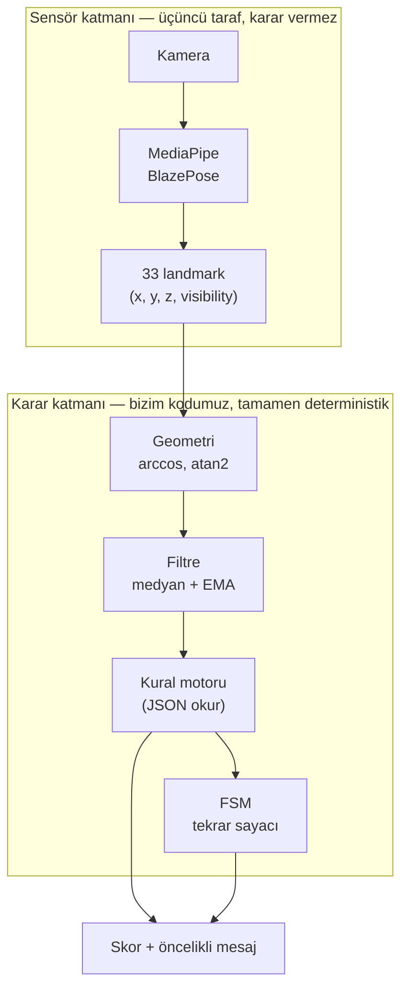

# ARCHITECTURE.md

Bu doküman, FormCheck'in mimari kararlarını ve bu kararların SOLID/DRY prensipleriyle ilişkisini açıklar. `CLAUDE.md` kuralları buradan türer; formüllerin kendisi için `personal-trainer-is-analizi.md` §5'e bakın.

Bu depo Python prototipidir; nihai hedef mobildir. Karar katmanı (geometri + kurallar) saf ve taşınabilir tutulur (bkz. §7).

---

## 1. Katmanlı mimari



**Neden bu ayrım var:** Hocanın kısıtı "model değil formül". MediaPipe kararı **vermiyor**, koordinat **üretiyor** — tıpkı bir kameranın ışık şiddetini piksel değerine çevirmesi gibi. Sınırı belirleyen soru: "Bu bileşen eğitim verisiyle mi ayarlandı, yoksa matematiksel bir kuralla mı?" Sensör katmanı birinci, karar katmanı ikinci gruptadır.

---

## 2. Veri akışı ve sorumluluklar

| Katman | Girdi | Çıktı | Nerede |
|---|---|---|---|
| Capture | Kamera / video dosyası | Frame + timestamp | `src/capture/` |
| Landmark | Frame | 33 × (x, y, z, visibility) | Kütüphane (MediaPipe) |
| Geometry | Landmark (piksel) | Açı (derece) | `src/geometry/` |
| Filter | Ham açı | Yumuşatılmış açı | `src/filter/` |
| Rule Engine | Açı + JSON kural | İhlal listesi + skor | `src/rules/` |
| FSM | Birincil açı | Tekrar sayısı, faz | `src/rules/` |
| UI | Hepsi | Ekran (OpenCV çizimi) | `src/ui/` |

---

## 3. SOLID prensiplerinin uygulanışı

Proje, saf fonksiyonlardan oluşan bir Python boru hattı; klasik ağır OOP sınıf hiyerarşisi değil. SOLID'in her maddesi burada bire bir sınıf/arayüz olarak değil, **modül sorumluluğu ve bağımlılık yönü** olarak karşılık buluyor. Zorlama eşleşme yapmak yerine her prensibi gerçek karşılığıyla eşliyoruz — biri (LSP) zayıf uyuyorsa bunu gizlemiyoruz.

### S — Single Responsibility (Tek Sorumluluk)

Her modülün değişme sebebi tektir:

| Modül | Değişme sebebi |
|---|---|
| `geometry/angles.py` | Açı formülü değişirse |
| `filter/smoothing.py` | Gürültü azaltma stratejisi değişirse |
| `rules/engine.py` | Kural değerlendirme mantığı değişirse |
| `rules/fsm.py` | Tekrar sayma mantığı değişirse |

Bir eşik değeri değiştiğinde **hiçbiri** değişmez — çünkü eşikler `exercises.json`'da yaşar, kodda değil. Bu, sorumluluğun kod ile veriyi ayırmasının doğrudan sonucu.

### O — Open/Closed (Açık/Kapalı)

**Bu proje için en kritik prensip.** Yeni egzersiz eklemek = yeni JSON girdisi. `rules/engine.py` değişmez.

```
Genişletme: exercises.json'a 6. egzersiz ekle       → dosya değişir, kod değişmez ✓
Değişiklik: rules/engine.py'de if/else ile           → her yeni egzersiz kodu değiştirir ✗
            egzersiz özel mantık yazmak
```

Kanıt: `calibration-poses.json`'daki 3 kalibrasyon pozu, `exercises.json`'daki 5 egzersizle **aynı şemayı** kullanıyor ve **sıfır ek kod** gerektirmedi. Motor zaten genişlemeye açık, değişikliğe kapalıydı.

### L — Liskov Substitution (Yerine Geçebilirlik)

Ağır sınıf hiyerarşisi olmadığı için bu prensip zayıf biçimde uygulanıyor — dürüst olmak gerekirse en az karşılığı bulan madde bu. En yakın işlevsel analog: **aynı sözleşmeyi (fonksiyon imzasını) uygulayan her fonksiyon birbirinin yerine geçebilmeli.**

```python
# Her açı tipi aynı sözleşmeyi uygular — hangisi çağrılırsa çağrılsın
# çağıran taraf (rules/engine.py) farkı bilmek zorunda değil
# jointAngle:    (a, b, c) -> float   # 3 nokta
# verticalAngle: (from, to) -> float  # 2 nokta

AngleCalculator = Callable[..., float]
```

`rules/engine.py`, açının `JOINT` mi `VERTICAL` mi olduğunu `exercises.json`'daki `"type"` alanından okur ve doğru hesaplayıcıyı çağırır — hangi egzersiz olduğunu bilmesi gerekmez. Bu, tam LSP değil ama ruhu aynı: **çağıran taraf, çağırdığı şeyin somut kimliğine bağımlı değil.**

### I — Interface Segregation (Arayüz Ayrımı)

Fonksiyon imzaları küçük ve odaklı tutuluyor — "her şeyi yapan tek dev fonksiyon" yok:

```python
# YANLIŞ olurdu: tek fonksiyon her şeyi alır
# def process_frame(landmarks, exercise, previous_state, config, filters, ...): ...

# DOĞRU: her fonksiyon yalnızca ihtiyacı olanı alır
def joint_angle(a: Point, b: Point, c: Point) -> float: ...
def smooth(key: str, raw: float) -> float: ...
def evaluate(angles: dict[str, float], ex: Exercise, phase: Phase) -> RuleResult: ...
```

Bir fonksiyonu test etmek için sistemin geri kalanını sahnelemene gerek yok — bu hem test edilebilirliği hem de agent'ların doğru kod üretme olasılığını artırıyor (küçük, net sözleşmeler agent hatası riskini azaltır).

### D — Dependency Inversion (Bağımlılığın Tersine Çevrilmesi)

Üst seviye modül (`rules/engine.py`) somut bir egzersize (`squat`, `plank`) değil, **soyut bir sözleşmeye** (JSON şeması / `Exercise` tipi) bağımlı:

```
rules/engine.py  →  bağımlı  →  "Exercise" tip tanımı (soyutlama)
                                          ↑
                                  exercises.json (somut veri)
```

Motor "squat nedir" bilmiyor, "bir Exercise nesnesi nasıl değerlendirilir" biliyor. Aynı ters bağımlılık `geometry/`'de de var: `joint_angle`, MediaPipe'ın `NormalizedLandmark` tipini değil, kendi tanımladığımız `Point` tipini alıyor — üçüncü taraf kütüphane değişirse (ör. MediaPipe'tan başka bir poz kütüphanesine geçilirse) yalnızca dönüştürme katmanı değişir, `geometry/` dokunulmaz. Bu, mobil sürüme taşımayı da mümkün kılan tam olarak bu sınırdır (bkz. §7).

---

## 4. DRY prensibi

**Tek doğruluk kaynağı kuralı:** Bir formül, projede tam olarak bir yerde yaşar.

| Ne | Tek yeri |
|---|---|
| Eklem açısı formülü | `geometry/angles.py` → `joint_angle` |
| Dikey açı formülü | `geometry/angles.py` → `vertical_angle` |
| Eşik değerleri | `exercises.json` / `calibration-poses.json` |
| Skorlama formülü | `rules/engine.py` → `evaluate` |

### Neden bu kadar katıyız — somut bir karşı örnek

Benzer bir açık kaynak proje (PostureGuard) incelendiğinde şu bulundu: `checkBackAngle` ve `checkSpineStraightness` fonksiyonları matematiksel olarak **aynı işlemi** yapıyor (`atan2` ile dikeyden sapma), ama biri sonuca 90 ekliyor, diğeri eklemiyor. İki ayrı yerde yazıldığı için biri güncellenirken diğeri unutulmuş ve **biri tersine çalışan bir kural üretmiş** (dimdik duran kullanıcıya "yüksek sakatlanma riski" diyor). Ayrıca aynı projede düzgün yazılmış bir `calculateAngle` fonksiyonu var ama hiçbir kuralda kullanılmamış — ölü kod, çünkü her doğrulayıcı kendi hesabını tekrar yazmış.

**Bizim `geometry/` sınırımız bu sınıfta hatayı yapısal olarak imkânsız kılıyor** — açı hesaplayan ikinci bir yer olmadığı için "iki yerde farklı davranan aynı formül" hatası oluşamaz.

### JSON-driven kurallar da DRY'ın bir uygulaması

Eşik mantığını kodda `if angle > 90:` şeklinde egzersiz egzersiz tekrarlamak yerine, tek bir `evaluate()` fonksiyonu her kuralı aynı yamuk üyelik fonksiyonuyla değerlendiriyor (bkz. spec §5.7). 5 egzersiz × ortalama 4 kural = 20 kural, ama değerlendirme kodu **bir tane**.

---

## 5. Modül sınır kuralı (mimari test edilebilirlik)

```
src/geometry/  →  MediaPipe yok, OpenCV yok, çizim yok. Saf fonksiyon (yalnızca NumPy).
src/rules/     →  MediaPipe yok, OpenCV yok, çizim yok. Saf fonksiyon.
```

Bu sınırın pratik sonucu: bu iki klasördeki her şey **kamera açılmadan** test edilebilir (`python -m pytest`, Node/tarayıcı gerekmez). Akademik savunma açısından değeri şu: "formüllerimiz kütüphaneden bağımsız test ediliyor" cümlesi, hocaya kodun gerçekten matematiksel olduğunu, gizli bir öğrenilmiş bileşene dayanmadığını kanıtlıyor.

**Piksel dönüşümü zorunluluğu bu sınırın bir parçası:** `geometry/` fonksiyonları asla ham `landmark.x/y` (MediaPipe normalize [0,1]) almaz — çağıran taraf `to_pixel()` ile dönüştürüp öyle çağırır. Sebep: normalize koordinatlar en-boy oranı 1:1 olmayan çözünürlüklerde (ör. 1280×720) yamuk bir uzay oluşturur, `arccos` bundan sistematik olarak yanlış açı üretir. Bu hatayı yakalamak için `calibration-poses.json`'daki Side Profile pozu var — dimdik duran bir insanın gövde eğimi matematiksel olarak 0° olmalı, sapma varsa dönüşüm katmanında hata vardır.

---

## 6. Test stratejisi ve SOLID ile ilişkisi

```
T0   Sentetik geometri testleri     →  SRP ve ISP'yi doğrular (fonksiyon izole test edilebiliyor mu)
T0'  Statik kalibrasyon pozları     →  OCP'yi doğrular (yeni "egzersiz" sıfır kodla eklendi mi)
T1–T6  Dinamik egzersiz testleri    →  Sistemin bütünsel doğruluğu
```

Testler `python -m pytest` ile çalışır; `geometry/` ve `rules/` testleri kamerasızdır. Detaylı test tabloları ve kabul kriterleri: `personal-trainer-is-analizi.md` §12.

---

## 7. Taşınabilirlik / mobil yol haritası

Karar motoru (`geometry/` + `rules/`) MediaPipe'a, OpenCV'ye ve kameraya bağımlı olmadığı için taşınabilir. Bu, §5'teki modül sınırının doğal bir sonucu, ek mimari değişiklik gerektirmiyor.

```
Katman 1 (şimdi)     src/geometry/ + src/rules/  — Python, sıfır dış bağımlılık (yalnızca NumPy)
Katman 2 (mobil)     aynı formüller mobil dile taşınır — MediaPipe mobilde de aynı 33 landmark'ı verir,
                     bu yüzden joint_angle / vertical_angle / evaluate mantığı birebir yeniden yazılabilir
Katman 3 (gelecek)   durumsuz analiz servisi — gerçek zamanlı OLMAYAN kullanım için (ör. video analiz portalı)
```

Gerçek zamanlı akış (kamera → anlık geri bildirim) her zaman cihazda kalır — bu bir mimari tercih değil, gecikme bütçesinin (≤300ms) fiziksel sonucu. Taşınan şey karar motorunun **mantığı**, kamera işleme değil.

---

## 8. Kapsam dışı (bilinçli olarak yapılmayan)

- Backend/veritabanı sunucusu — gerçek zamanlı akış buna izin vermiyor (bkz. §7)
- Sınıflandırma modeli, eğitim döngüsü, ağırlık dosyası — hocanın kısıtı (MediaPipe'ın hazır modeli sensör katmanıdır, istisnadır)
- Ağır sınıf tabanlı OOP hiyerarşisi — saf fonksiyonel yaklaşım bu ölçekte daha az dolaylama gerektiriyor, SOLID prensipleri modül/fonksiyon seviyesinde uygulanıyor